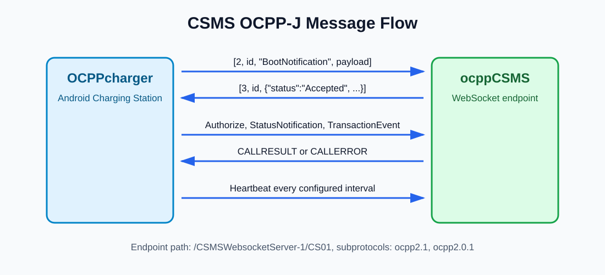

# ocppCSMS

Java EE WebSocket CSMS server for the demo OCPP charging station flow.

It talks to `OCPPcharger` over OCPP-J JSON array frames and currently supports the core demo path: boot, authorization, heartbeat, connector status, and transaction events.

## Message Flow



## WebSocket Endpoint

The endpoint is defined in:

```text
src/main/java/com/csmswebsocketserver/NewWSEndpoint.java
```

Endpoint path:

```text
/{client}
```

When deployed as `CSMSWebsocketServer-1`, the Android charger uses:

```text
ws://<host>:8080/CSMSWebsocketServer-1/CS01
```

`CS01` is treated as the charging station identity. The endpoint also keeps older operator/app path handling for non-charger clients.

Supported WebSocket subprotocols:

```text
ocpp2.1
ocpp2.0.1
CSOProtocol
appUserProtocol
```

## OCPP-J Frame Format

The server decoder and encoders use standard OCPP-J array frames:

```json
[2, "message-id", "Action", {"payload":"object"}]
[3, "message-id", {"response":"payload"}]
[4, "message-id", "ErrorCode", "Error description", {}]
```

Relevant files:

| File | Responsibility |
| --- | --- |
| `MessageDecoderboth.java` | Parses OCPP-J `CALL`, `CALLRESULT`, and `CALLERROR`. |
| `MessageEncoder.java` | Encodes `CALL`. |
| `MessageEncodeResult.java` | Encodes `CALLRESULT`. |
| `MessageEncodeError.java` | Encodes `CALLERROR`. |
| `CALL.java`, `CALLRESULT.java`, `CALLERROR.java` | Message models. |

## Supported Charger Actions

This project has a basic OCPP 2.1 implementation. It does not implement every feature in the OCPP 2.1 specification. The full protocol includes advanced areas such as smart charging, certificate management, firmware/log transfer, tariffs, DER control, reservations, monitoring reports, event streams, and local authorization lists.

The server now recognizes the OCPP 2.1 schema action set through `OcppActionRegistry`. Implemented demo actions are processed normally. Known OCPP actions that are not implemented return `CALLERROR` with `NotSupported`. Unknown actions return `CALLERROR` with `NotImplemented`.

The message models keep the OCPP message id on each decoded/encoded frame, so multiple charging-station sessions do not overwrite each other while the server builds `CALLRESULT` and `CALLERROR` responses.

| Action | Current CSMS Behavior |
| --- | --- |
| `BootNotification` | Replies with `Accepted`, current UTC time, and heartbeat interval. |
| `Authorize` | Accepts PIN `1234`; accepts non-empty RFID `ISO14443`; rejects other tokens. |
| `Heartbeat` | Replies with `currentTime`. |
| `StatusNotification` | Acknowledges connector status update. |
| `TransactionEvent` | Acknowledges transaction event. |
| `MeterValues` | Acknowledges meter samples for simple/demo chargers. |
| `DataTransfer` | Replies with `Accepted` for basic pass-through testing. |
| `NotifyReport`, `NotifyEvent` | Acknowledges report/event notifications. |
| `FirmwareStatusNotification`, `LogStatusNotification`, `PublishFirmwareStatusNotification`, `SecurityEventNotification` | Acknowledges status notifications. |
| Known unsupported OCPP action | Returns OCPP `CALLERROR` with `NotSupported`. |
| Unknown action | Returns OCPP `CALLERROR` with `NotImplemented`. |

## Basic CSMS-Originated Requests

`SendRequestToCS` can send basic OCPP-J `CALL` messages to a connected charger session:

| Action | Helper |
| --- | --- |
| `ChangeAvailability` | `sendChangeAvailabilityRequest(...)` |
| `CostUpdated` | `sendCostUpdatedRequest(...)` |
| `Reset` | `sendResetRequest(...)` |
| `SetDisplayMessage` | `sendSetDisplayMessageRequest(...)` |
| `SetVariables` | `sendSetVariablesRequest(...)` |
| `GetVariables` | `sendGetVariablesRequest(...)` |
| `GetBaseReport` | `sendGetBaseReportRequest(...)` |

`OCPPbasedCSO` can also trigger the basic operator actions through `/CSO`. The CSO sends a JSON admin message and the CSMS forwards it to the connected charger as a normal OCPP-J `CALL`:

```json
{"type":"ForwardOcppCall","chargingStationId":"CS01","action":"SetVariables","payload":{"setVariableData":[]}}
{"type":"ForwardOcppCall","chargingStationId":"CS01","action":"GetVariables","payload":{"getVariableData":[]}}
{"type":"ForwardOcppCall","chargingStationId":"CS01","action":"SetDisplayMessage","payload":{"message":{}}}
{"type":"ForwardOcppCall","chargingStationId":"CS01","action":"GetDisplayMessages","payload":{"requestId":1}}
```

CSMS replies to the CSO with `OcppForwardResult`, then relays the charger response as `OcppCallResult` or `OcppCallError`. For `GetDisplayMessages`, charger-originated `NotifyDisplayMessages` payloads are relayed as `OcppNotifyDisplayMessages`.

## Example Boot Flow

Charger sends:

```json
[2, "abc", "BootNotification", {
  "reason": "PowerUp",
  "chargingStation": {
    "model": "Model",
    "vendorName": "Vendor"
  }
}]
```

CSMS replies:

```json
[3, "abc", {
  "currentTime": "2026-05-23T00:00:00Z",
  "interval": 300,
  "status": "Accepted"
}]
```

## Authorization Rules

Authorization checks the RFID/PIN user registry managed by `OCPPbasedCSO`. The registry is in-memory for this basic implementation and starts with two demo entries:

| Token Type | Accepted When |
| --- | --- |
| `KeyCode` | `idToken` equals `1234`, or another accepted CSO-managed key code exists. |
| `ISO14443` | The RFID UID exists in the CSO-managed registry with status `Accepted`. |

The response uses `idTokenInfo.status` and optional OCPP fields only when they are present.

## CSO RFID Admin

`OCPPbasedCSO` connects to the same WebSocket endpoint as client `CSO`:

```text
ws://<host>:8080/CSMSWebsocketServer-1/CSO
```

It sends small JSON admin messages to manage the CSMS RFID registry:

```json
{"type":"RfidUsersList"}
{"type":"RfidUserUpsert","idToken":"04AABBCC","tokenType":"ISO14443","userName":"Demo Driver","status":"Accepted"}
{"type":"RfidUserDelete","idToken":"04AABBCC"}
```

This is intentionally not sent to the charger. The charger remains OCPP-facing and sends `Authorize` with `idToken`; the CSMS checks the CSO registry and returns `idTokenInfo.status`.

## Build

Requirements:

- Java JDK 8+
- Maven
- Java EE/WebSocket capable server

Compile:

```bash
mvn -q -DskipTests compile
```

Package WAR:

```bash
mvn package
```

The Maven artifact is:

```text
CSMSWebsocketServer-1.war
```

Deploy that WAR to your server, then connect the Android charger to:

```text
ws://<server-ip>:8080/CSMSWebsocketServer-1/CS01
```

## Notes

- All timestamps should be RFC3339 style date-time strings with timezone.
- The current implementation is a demo CSMS, not a complete OCPP 2.1 compliance suite.
- `ChangeAvailability`, `SetVariables`, `GetVariables`, and display-message server-originated flows have request/response classes in the repo and can be expanded for operator control.
